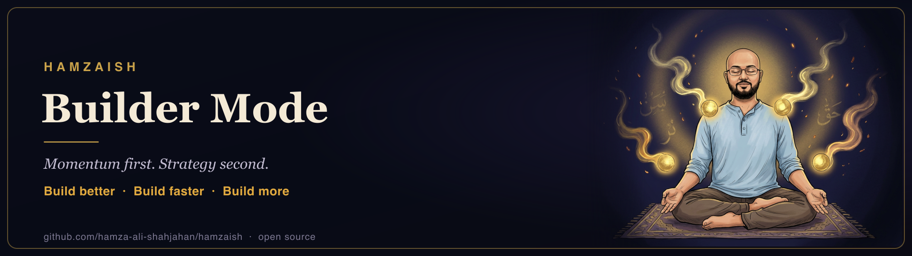
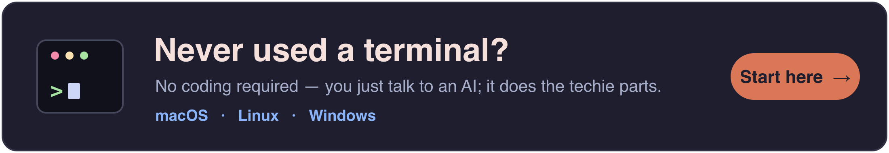

<div align="center">

# 🏭 Hamzaish

**Unlock your Builder Mode — build the product, then everything after it.**

Not another AI coding setup. AI already writes your code — nobody's running your launch, your pricing, your first hundred customers, or the kill-call. Hamzaish is an open-source Claude Code setup that runs the whole life of a product, and remembers every lesson for your next one. Works with **Claude Code, Cursor, Codex & Windsurf**.

[](docs/start-here.md)
[](docs/security.md)
[](AGENTS.md)
[](docs/contributing.md)

</div>

## See it work

<p align="center">
  
</p>

<!-- v1 "factory in motion" demo (real command output, reproducible via scripts/hero.tape). Replace with the live idea→scaffold→ship TUI recording when ready. -->

Type one sentence. Get a local-first product running in 60 seconds — zero accounts, zero config. Then take it past localhost: `/go-live` wires the stack you set up once, the security gate clears it, and `/ship` puts it on a real URL people can sign up at. *Shipped through it so far: 6 products with public artifacts — live sites, npm CLIs, OSS tools → [the showcase](products/SHOWCASE.md).*

## The 11pm moment

[](docs/builder-mode.md)

**Most AI tools stop when the code is done. Builders' problems start there.**

Every builder knows the moment: it's 11pm, you have an idea, and your hands are itching to build. Then the "right way" kicks in — business plans, market sizing, twenty validation interviews — and by the time the strategy funnel is done with you, the spark is dead. **Strategy-first kills more builders than bad ideas ever did.**

That advice was written for a world where building was expensive. That world is gone. With AI, building is cheap, fast, and reversible — **the thing you ship *is* the test.** Builder Mode is that flipped calculus made a working mode: build aggressively with instinct, validate iteratively, scale with strategy. Strategy is a rail you pull in — never a toll you pay to start.

But most solo projects don't die in the build. They die in everything *after* it: the security review, the launch, the pricing call, the first-100-customers grind, knowing when to kill. Hamzaish is Builder Mode as a working system — it runs the whole lifecycle, **Ideate → MVP → Launch → Sell → Scale → Kill-or-double-down**, with stage-specific agents, playbooks distilled from real ships, and a brain that carries every lesson into your next product.

**→ [The full mission: Builder Mode](docs/builder-mode.md) · [The philosophy](docs/philosophy.md)**

## What it feels like

> **11:04pm.** You type `/builder-mode` and one sentence about the idea. A minute later a local product is running — no accounts, no config, no business plan demanded first. The strategy funnel never got a vote.

> **Launch morning.** `/go-live` wires the accounts you set up once — database, payments, email, analytics, your domain. The security gate reads the product and says **BLOCK** — seventy concrete checks, a forced verdict — and names why. You fix it, it says **CLEAR**, `/ship` deploys. The link you share isn't `localhost:3000`. It's your domain, live, and people can sign up.

> **Product #2.** Your first product passed 138 tests and still broke in production. That lesson is a guardrail now, not a memory — your second build inherits it automatically, and plugs into the same accounts with no re-setup. This is the part that compounds.

Localhost is where products are born, not where they live. Local-first means you start free and instant — it never means you stay there.

## What's inside

| | | |
|---|---|---|
| 🧠 **A brain that remembers** | learnings, decisions, and anti-patterns — SQLite-indexed, searchable from any session via `/brain-ask` | [`brain/`](brain/) |
| 🏭 **A factory that acts** | 35 agents + 63 skills & commands across the lifecycle — idea validation, architecture, scope-guarding, landing copy, SEO, cold outreach, retention, kill-or-double-down | [`factory/`](factory/) |
| 📖 **Playbooks with receipts** | 49 playbooks · 146 practices — each badged ✅ proven by a real ship / 🟡 partial / ⏳ research-baked | [BEST-PRACTICES.md](BEST-PRACTICES.md) |
| 🔒 **A gate that blocks** | 70-check pre-launch security review (backend-reality, auth, authz, data exposure, secrets) with a forced BLOCK/CLEAR verdict | [security checklist](factory/playbooks/mvp-stage/security-checklist.md) |
| 🧪 **An engine that proves** | eval-gated build cycle — a feature slice without a named eval + an end-to-end test doesn't get built | [`/full-cycle`](factory/commands/full-cycle.md) |
| 📡 **Senses that record** | session traces from your first session — every tool call and failure logged locally (gitignored, nothing leaves your machine); `bun run trace-report` grounds retros in what happened, not what you remember | [`scripts/trace-report.ts`](scripts/trace-report.ts) |
| 🔌 **A stack you set up once** | Vercel, Supabase, Stripe, Resend, PostHog, Sentry, your domain — sign up once, free-tier-first, pre-wired in every scaffold; every product after plugs into the same accounts | [`stack/`](stack/README.md) |
| 🗂️ **Portfolio discipline** | `/portfolio-pulse` across everything you run; quarterly kill-or-double-down so zombie projects don't eat your year | [`/kill-or-keep`](factory/skills/kill-or-keep/SKILL.md) |

**Every count real, every item linked, every claim badged.** The full catalog, expanded:

<details><summary><b>🤖 The agents (35) — lifecycle + engineering</b></summary>

One router + 31 lifecycle-stage agents + 3 engineering subagents under [`factory/agents/`](factory/agents/). Each is a markdown SKILL.md your session invokes by intent — the routing table lives in [`CLAUDE.md`](CLAUDE.md).

### 💡 Idea stage (7)

| Agent | What it does |
|---|---|
| [idea-generator](factory/agents/idea/idea-generator/SKILL.md) | Generate startup ideas grounded in your patterns, current trends, and validated demand signals |
| [problem-sharpener](factory/agents/idea/problem-sharpener/SKILL.md) | Turn vague observations into testable hypotheses with specific who/when/severity/workaround |
| [devils-advocate](factory/agents/idea/devils-advocate/SKILL.md) | Build the strongest case AGAINST an idea; hunt disconfirming evidence |
| [market-researcher](factory/agents/idea/market-researcher/SKILL.md) | TAM/SAM/SOM, trends, buyer landscape — anchored in citable public data, not vibes |
| [competitor-mapper](factory/agents/idea/competitor-mapper/SKILL.md) | Map the landscape by tier (direct/indirect/acquirer/adjacent) and argue why each could win |
| [customer-discovery](factory/agents/idea/customer-discovery/SKILL.md) | Target profile, prospect list, interview script, outreach setup |
| [interview-synthesizer](factory/agents/idea/interview-synthesizer/SKILL.md) | Synthesize interview batches into evidence-for vs evidence-against |

### 🏗️ MVP stage (5)

| Agent | What it does |
|---|---|
| [architect](factory/agents/mvp/architect/SKILL.md) | Define the architecture BEFORE a line is written — CLAUDE.md, scope.md, 1-page ADR |
| [builder](factory/agents/mvp/builder/SKILL.md) | Drive build sessions with enforced discipline: read context first, one topic per session |
| [scope-guardian](factory/agents/mvp/scope-guardian/SKILL.md) | Block scope creep — every feature ask pressure-tested against scope.md |
| [security-reviewer](factory/agents/mvp/security-reviewer/SKILL.md) | Pre-launch review: auth, data exposure, input validation, dependency vulns |
| [metric-framework-designer](factory/agents/mvp/metric-framework-designer/SKILL.md) | North star, activation, retention targets, Sean Ellis — defined BEFORE launch |

### 🚀 Launch stage (9)

| Agent | What it does |
|---|---|
| [brand-story-builder](factory/agents/launch/brand-story-builder/SKILL.md) | Positioning, story, voice, naming, visual primitives |
| [landing-page-copywriter](factory/agents/launch/landing-page-copywriter/SKILL.md) | Hero + value props + social proof + objections + CTA, anchored on validated pain |
| [seo-strategist](factory/agents/launch/seo-strategist/SKILL.md) | Content hubs, target keywords, internal linking, schema, technical baseline |
| [keyword-researcher](factory/agents/launch/keyword-researcher/SKILL.md) | Real keyword data from GSC + Ahrefs Webmaster + DataForSEO |
| [content-marketer](factory/agents/launch/content-marketer/SKILL.md) | Content calendars and drafts — blog, social, LinkedIn, threads |
| [launch-strategist](factory/agents/launch/launch-strategist/SKILL.md) | Product Hunt, Hacker News, X, LinkedIn, newsletters — sequenced for compounding signal |
| [cold-outreach](factory/agents/launch/cold-outreach/SKILL.md) | First 100 customers by hand: sourcing → personalized messages → cadence → tracking |
| [pricing-strategist](factory/agents/launch/pricing-strategist/SKILL.md) | Packaging, tiers, anchor, monthly vs annual, free vs trial |
| [community-builder](factory/agents/launch/community-builder/SKILL.md) | Discord/Slack/forum, waitlist nurture, early-user comms |

### 📈 Scale stage (6)

| Agent | What it does |
|---|---|
| [growth-loops](factory/agents/scale/growth-loops/SKILL.md) | Design acquisition/monetization/engagement loops (Reforge framework) |
| [retention-analyst](factory/agents/scale/retention-analyst/SKILL.md) | Retention curves, churn drivers, leaky-bucket vs activation-problem diagnosis |
| [pricing-optimizer](factory/agents/scale/pricing-optimizer/SKILL.md) | Post-PMF pricing iteration from real willingness-to-pay data |
| [support-triage](factory/agents/scale/support-triage/SKILL.md) | Categorize, prioritize, draft responses; bug vs user-error vs feature-request |
| [moat-builder](factory/agents/scale/moat-builder/SKILL.md) | Workflow lock-in, data network effects, domain depth, integration depth |
| [compliance-auditor](factory/agents/scale/compliance-auditor/SKILL.md) | SOC2 / GDPR / HIPAA / CCPA gap analysis with prioritized remediation |

### 🗂️ Portfolio (4) + the router

| Agent | What it does |
|---|---|
| [portfolio-conductor](factory/agents/portfolio/portfolio-conductor/SKILL.md) | Where attention goes today — "if you had 4 hours, spend them here" |
| [telemetry-aggregator](factory/agents/portfolio/telemetry-aggregator/SKILL.md) | Metrics across all products in a single view |
| [cross-product-learner](factory/agents/portfolio/cross-product-learner/SKILL.md) | What's working that should propagate; what's failing in similar ways |
| [kill-or-double-down](factory/agents/portfolio/kill-or-double-down/SKILL.md) | Quarterly hard calls: kill, maintain, or double down — forced verdicts |
| [_orchestrator](factory/agents/_orchestrator/SKILL.md) | The routing brain that picks the right agent for the request |

### 🔧 Engineering subagents (3)

| Agent | What it does |
|---|---|
| [code-reviewer](factory/agents/engineering/code-reviewer/SKILL.md) | Deep multi-axis review of a change before merge |
| [security-auditor](factory/agents/engineering/security-auditor/SKILL.md) | Hunts injection, authz gaps, secret exposure, unsafe deserialization |
| [test-engineer](factory/agents/engineering/test-engineer/SKILL.md) | Designs and fills test coverage; reproduces bugs as failing tests |

</details>

<details><summary><b>🛠️ The skills & commands (63)</b></summary>

41 skills + 22 commands under [`factory/skills/`](factory/skills/) and [`factory/commands/`](factory/commands/) — auto-discovered by Claude Code after `bun run setup`. Every `/name` has exactly one home — a skill folder or a command file, never both (same-name pairs double-load into session context; CI enforces it).

| Invoke | What it does |
|---|---|
| `/builder-mode` | **The front door** — enter Builder Mode: default is *just build*; strategy rails are opt-in, skip anytime. (Alias: `/hamzaish` — same engine.) |
| `/scaffold` | One-shot a new product: folders, starter, config, CLAUDE.md, scope, PRD skeleton |
| `/validate` | Full validation pass: sharpening, devil's advocate, market sizing, competitor map, discovery plan |
| `/ideate` | Generate ideas grounded in your portfolio patterns + current trends |
| `/work-on` | Enter a product workspace with full context loaded |
| `/portfolio-pulse` | All products: one table, top 3 priorities, on-fire, don't-touch |
| `/product-pulse` | One product: metrics, stage, blockers, the #1 action today |
| `/kill-or-keep` | Quarterly review with forced verdicts for every product |
| `/launch-plan` | Full launch playbook: PH, HN, X, LinkedIn, email warm-up, outreach, pricing, brand assets |
| `/web-launch` | Verification-gated website launch: per-project workbook, refuse-to-launch sign-off gate, post-launch monitoring |
| *(skill)* `launch-gotchas` | Library of real launch failure modes — indexation, redirects, analytics undercounting — with the fix for each |
| *(skill)* `pseo-at-scale` | Programmatic-SEO discipline for 100s–10,000s of templated pages: thin-content prevention, indexation ramp |
| `/release` | Cut a polished GitHub Release from the changelog at a major-cycle boundary |
| `/keyword-research` | Clustered keyword brief from GSC + Ahrefs Webmaster + DataForSEO |
| `/seo-aeo-bootstrap` | Ship the SEO + AEO foundation: llms.txt, AI-bot robots.txt, JSON-LD, sitemap, meta block |
| `/name-product` | End-to-end naming pipeline: brief → competitors → generate → clear → select → lock |
| `/name-clearance` | Clear a name BEFORE buying the domain: collision, trademark signal, availability |
| `/competitor-research` | Map the competitive landscape; persists per-product so it compounds |
| `/go-live` | Guided, stateful stack provisioning — deep-links, key validation, `.env.local` writes, resumable; then hands to `/security-check` → `/ship` |
| `/security-check` | Fast security baseline: tracked secrets, vulnerable Actions, workflow permissions |
| `/ship` | The single deploy action — gates on `/security-check`, promotes reviewed commits to production |
| `/checkpoint` | Named save-point commit between auto-commits |
| `/brain-ask` | Search every learning, decision, playbook, and product doc — ranked citations |
| `/brain-ingest` | Refresh the brain's SQLite FTS5 index |
| `/learn-loop` | Impact-score the cycle's learnings; promote only the top few into guardrails |
| `/pr` | One-command **repo** ship: branch → commit → PR → wait for CI → squash-merge → sync local |
| *(skill)* `tidy` | The cleanup stage: scan a repo — or 100+ at once — for rot, see the extent, then clean with confirmation |
| *(skill)* `write-a-goal` | Turn a rough ambition into a measurable, reachable goal — capability + named metric + ≥2 numeric evals + acceptance rule |
| *(skills)* `product-pulse` · `seo-aeo-bootstrap` | Skills without a command wrapper yet — invoke by name in Claude Code |

### 🔧 The engineering cycle — `/full-cycle` and its phases

Consolidated into Hamzaish so the build engine ships **with** the repo (no separate install). `/builder-mode` routes here for real builds — starting from a **goal**, slicing it into features that can each be *proven* (an eval + an end-to-end test), and only then spec'ing and building. Features you can't evaluate or test don't make the cut.

| Invoke | What it does |
|---|---|
| `/full-cycle` | The gated engine: GOAL → SETUP → SLICE → SPEC → PLAN → TEST → BUILD → REVIEW → SHIP, pausing for approval at each gate |
| `/goal` | Pursue a measurable objective autonomously — rubric + fresh-eyes verification, iterate to the bar, resumable run-log (sibling of `/builder-mode`) |
| `/auto` | The same cycle run autonomously end-to-end — no per-gate stops; still pauses for irreversible/outward actions |
| *(skill)* `feature-slicing` | Slice a goal into provable feature slices — keep only the ones that come with an eval + an end-to-end test |
| *(skill)* `write-a-goal` | Forge a fuzzy ambition into a measurable, reachable goal — metric + evals + acceptance + non-goals |
| `/spec` | Write a structured spec before any code (for the selected slices) |
| `/plan` | Break the spec into small, ordered, verifiable tasks |
| `/build` | Implement the next task incrementally (TDD: red → green → refactor → commit) |
| `/test` | Drive behavior with tests; browser-test real UIs via DevTools |
| `/review` | Five-axis code review — correctness, readability, architecture, security, performance |
| `/code-simplify` | Reduce complexity for clarity without changing behavior |
| `/setup` | Bootstrap a project's Claude Code context (CLAUDE.md, rules, a starter command) |

Backed by **22 engineering skills** under [`factory/skills/`](factory/skills/) — feature-slicing, spec-driven-development, planning-and-task-breakdown, incremental-implementation, test-driven-development, debugging-and-error-recovery, code-review-and-quality, security-and-hardening, performance-optimization, frontend-ui-engineering, api-and-interface-design, browser-testing-with-devtools, ci-cd-and-automation, documentation-and-adrs, git-workflow-and-versioning, source-driven-development, context-engineering, deprecation-and-migration, code-simplification, shipping-and-launch, idea-refine, auto-orchestrator — invoked by name as the cycle runs.

</details>

<details><summary><b>📖 The playbooks (49) + the practices ledger (146)</b></summary>

**[BEST-PRACTICES.md](BEST-PRACTICES.md)** — 146 practices for shipping products with Claude Code: **44 ✅ proven** by real ships and dated incidents · **3 🟡 partially proven** · **99 ⏳ research-baked** from named sources. Anti-patterns lead — each one cost us something real. Every line links to its deep-dive playbook and its source.

Playbooks are short (300–800 words), sourced, stage-gated:

| Stage | Playbooks |
|---|---|
| **💡 Idea (6)** | [The Mom Test](factory/playbooks/idea-stage/mom-test.md) · [Jobs-to-be-Done](factory/playbooks/idea-stage/jobs-to-be-done.md) · [Problem-Statement Rubric](factory/playbooks/idea-stage/problem-statement-rubric.md) · [TAM/SAM/SOM](factory/playbooks/idea-stage/tam-sam-som-templates.md) · [YC Startup School notes](factory/playbooks/idea-stage/yc-startup-school-notes.md) · [Landscape Research Before Roadmap](factory/playbooks/idea-stage/landscape-research-before-roadmap.md) |
| **🏗️ MVP (8)** | [Security Checklist — 70 checks](factory/playbooks/mvp-stage/security-checklist.md) · [Architecture Decisions](factory/playbooks/mvp-stage/architecture-decisions.md) · [AI-Native Dev Loop](factory/playbooks/mvp-stage/ai-native-dev-loop.md) · [Scope Document](factory/playbooks/mvp-stage/scope-document.md) · [Measurement Framework](factory/playbooks/mvp-stage/measurement-framework.md) · [Sean Ellis Survey](factory/playbooks/mvp-stage/sean-ellis-survey.md) · [Agent Handoff Contracts](factory/playbooks/mvp-stage/agent-handoff-contracts.md) · [Fleet Patterns](factory/playbooks/mvp-stage/fleet-patterns.md) |
| **🚀 Launch (13)** | [First 100 Customers](factory/playbooks/launch-stage/first-100-customers.md) · [Hacker News Launch](factory/playbooks/launch-stage/hacker-news-launch.md) · [Product Hunt Launch](factory/playbooks/launch-stage/product-hunt-launch.md) · [Pricing](factory/playbooks/launch-stage/pricing-playbook.md) · [Cold Outreach Templates](factory/playbooks/launch-stage/cold-outreach-templates.md) · [SEO+AEO Foundation](factory/playbooks/launch-stage/seo-aeo-foundation.md) · [SEO Content Strategy](factory/playbooks/launch-stage/seo-content-strategy.md) · [OSS Publishing Checklist](factory/playbooks/launch-stage/oss-publishing-checklist.md) · [Output Validation for Code-Gen Tools](factory/playbooks/launch-stage/output-validation-for-codegen-tools.md) · [Lenny's Frameworks Distilled](factory/playbooks/launch-stage/lenny-newsletter-distilled.md) · [Release Cadence as Content](factory/playbooks/launch-stage/release-cadence-as-content.md) · [Repo Go-Public Checklist](factory/playbooks/launch-stage/repo-go-public-checklist.md) · [Community Flywheel](factory/playbooks/launch-stage/community-flywheel.md) |
| **📈 Scale (8)** | [100→1000 Customers](factory/playbooks/scale-stage/100-to-1000-customers.md) · [Production Operations](factory/playbooks/scale-stage/production-operations.md) · [Abuse & Cost Controls](factory/playbooks/scale-stage/abuse-and-cost-controls.md) · [Churn Reduction](factory/playbooks/scale-stage/churn-reduction.md) · [Growth Loops (Reforge)](factory/playbooks/scale-stage/growth-loops-reforge.md) · [Moat Building](factory/playbooks/scale-stage/moat-building.md) · [Enterprise Readiness](factory/playbooks/scale-stage/enterprise-readiness.md) · [Security at Scale](factory/playbooks/scale-stage/security-at-scale.md) |
| **🧭 Founder's wisdom (4)** | [$100K ARR Tactics](factory/playbooks/founders-wisdom/100k-arr-tactics.md) · [Gary Tan / YC era advice](factory/playbooks/founders-wisdom/gary-tan-yc-advice.md) · [Paul Graham essays](factory/playbooks/founders-wisdom/paul-graham-essays.md) · [Solopreneur Stack 2026](factory/playbooks/founders-wisdom/solopreneur-stack.md) |
| **🤖 AI-native (10)** | [Eval-Driven Development](factory/playbooks/ai-native-2026/eval-driven-development.md) · [Cost-to-Outcome & Model-Independence](factory/playbooks/ai-native-2026/cost-to-outcome-and-model-independence.md) · [Founder's Playbook distilled](factory/playbooks/ai-native-2026/founders-playbook-distilled.md) · [Auth Go-Live](factory/playbooks/ai-native-2026/auth-go-live.md) · [Go-Live Provisioning](factory/playbooks/ai-native-2026/go-live-provisioning.md) · [MCP Servers per Product](factory/playbooks/ai-native-2026/mcp-servers.md) · [Hermes & Fallback Models](factory/playbooks/ai-native-2026/hermes-and-fallback-models.md) · [Skill Authoring](factory/playbooks/ai-native-2026/skill-authoring.md) · [Handoff vs Supervision](factory/playbooks/ai-native-2026/handoff-vs-supervision.md) · [Multi-Agent, One Repo](factory/playbooks/ai-native-2026/multi-agent-one-repo.md) |

</details>

## How it's different

| | build-stage setups<br>(gstack / BMAD / SuperClaude) | AI app builders<br>(Lovable / v0 / Bolt) | agent frameworks<br>(AutoGPT / crewAI) | personal AI OS<br>(assistant runtimes) | **Hamzaish** |
|---|---|---|---|---|---|
| Scope | build stage only | build + host a prototype | a framework you assemble | your inbox, tasks, and tools | **a product's whole life** |
| The output | code | an app on their platform | an agent run | a tidier day | **a live product on your domain** |
| After "code is done" | you're on your own | hosting, then you're on your own | you're on your own | not its job | **launch, sell, scale, kill rails** |
| Memory across projects | per-session | per-project | per-run | app-level memory service | **persistent brain + learnings loop** |
| Runs on | config + tools | their cloud | a Python service | containers + a database stack | **a folder + Claude Code** |
| Form | config | closed platform | framework | hosted app | **markdown-first method, forkable — yours** |

## Two doors in

### 🚀 Comfortable in a terminal? First win in 5 minutes

**One command** (installs Bun if missing, clones, sets up — [read it first](install.sh)):

```bash
curl -fsSL https://raw.githubusercontent.com/hamza-ali-shahjahan/hamzaish/main/install.sh | sh
```

<details><summary>…or set it up by hand</summary>

You need [Bun](https://bun.sh) and [Claude Code](https://claude.ai/code).

```bash
git clone https://github.com/hamza-ali-shahjahan/hamzaish.git
cd hamzaish
bun run setup        # idempotent — creates YOUR factory, never touches existing data
```
</details>

Then open Claude Code and type:

```
/builder-mode a tip calculator for freelancers
```

Watch it scaffold a **local-first product that runs in 60 seconds — zero accounts, zero config.** Local is mile one, not the destination: when you're ready, **`/go-live`** wires the accounts you set up once (Supabase, Stripe, Resend, your domain…), **`/security-check`** gates it, and **`/ship`** puts it live on a URL you can share. ([The 10-minute guided version →](docs/your-first-product.md))

### 🌱 Never used a terminal? You can absolutely do this

<a href="docs/start-here.md"></a>

No coding required — you talk to an AI and it does the techie parts. **One honest catch first:** Hamzaish runs on **Claude Code**, which needs a **paid Claude plan** — there's **no free tier**. Better to know that now than five steps in. If that's a yes: **get the Claude app → download Hamzaish (a ZIP, no git) → open the folder and type one sentence.**

**→ [The complete click-by-click walkthrough — pick your machine, no jargon →](docs/start-here.md)** (🍎 Mac · 🐧 Linux · 🪟 Windows — every step with "what you'll see" + a troubleshooting kit).

**Safety, either door:** scaffolded products run agent-generated code inside a devcontainer, secrets are gitignored from commit zero, and nothing auto-pushes off your machine. ([Full threat model →](docs/security.md))

## The discipline

1. **Build is the default — validate before irreversible bets.** Cheap, fast, reversible ships *are* validation. Before expensive moves: ~5 target-profile conversations. The hard rule: never skip it *silently* — `bun run check-validation <slug>` records the debt.
2. **Scope is the moat.** Every product's `scope.md` says what it does AND deliberately doesn't.
3. **Persistent context.** Every product gets a `CLAUDE.md`; every decision is logged in `decisions/`.
4. **Measurement before launch.** North-star, activation, retention — defined before the first user.
5. **The factory is a product.** If it can't ship product #1 through, fix the factory before adding slots.
6. **Honest copy.** Every outward-facing word is true and verifiable when it ships; aspiration is labelled, never present-tense. Proven vs. promising is tracked in [the honest ledger](meta/RESEARCH-BAKED-PRACTICES.md).

## The self-improvement loop

Every working session appends learnings to [`brain/learnings/`](brain/learnings/). At major-cycle boundaries, `/learn-loop` scores candidates on five axes ([rubric](meta/learning-loop-rubric.md)) and promotes only the top few into load-bearing guardrails — a skill rule, a playbook step, an anti-pattern, a line in [the practices ledger](BEST-PRACTICES.md). Quarterly, `/kill-or-keep` runs on Hamzaish itself and re-checks each promoted guardrail: deliver the predicted gain, or get sunset. The factory compounds; it doesn't ossify.

## Architecture

```
brain/        — identity, principles, learnings, anti-patterns, decisions, ingested knowledge
factory/      — agents (idea/ mvp/ launch/ scale/ portfolio/), skills, commands, playbooks
products/     — one folder per product: metadata + learnings ONLY (code stays in private repos)
meta/         — changelog, retros, evals, the self-improvement loop
stack/        — tech defaults + the set-up-once accounts guide
templates/    — Next.js starter + doc templates
```

Product **code is never in this repo** — only metadata and learnings. Your code (the moat) stays private; locations are wired via a git-ignored `code-paths.local.json`. So the repo is safe to share without exposing anyone's secret sauce. ([the public/private boundary →](docs/architecture.md#the-publicprivate-boundary--protecting-your-secret-sauce))

## Go deeper

[Start here — total beginner](docs/start-here.md) · [Your first product in 10 minutes](docs/your-first-product.md) · [FAQ](docs/FAQ.md) · [Architecture](docs/architecture.md) · [Philosophy](docs/philosophy.md) · [Where it's heading](meta/SELF-EVOLUTION.md) · [Security model](docs/security.md) · [Contributing](docs/contributing.md) · [Changelog](meta/changelog.md)

---

<div align="center">

### 💛 Built on a thousand generosities

[](ACKNOWLEDGMENTS.md)

*We stand on giants, and we're loud about it.*
**[Read the full credits →](ACKNOWLEDGMENTS.md)**

</div>

The backbone is hard-won venture experience — the Business-SWAT roles, opportunities, and mentors that came with years at **[Disrupt.com](https://disrupt.com)**, taking things from zero to one before AI made building cheap. On that foundation, the patterns studied and credited — Addy Osmani's spec→ship discipline, Karpathy's eval-driven flywheel, gbrain (knowledge graph), Anthropic's *Founder's Playbook* (lifecycle framing), hermes-agent (self-improving skills), openclaw (multi-channel gateway), and ponytail (multi-agent portability) — sharpened that instinct and 10×'d the AI and agentic-building learning on top of it. Study material lives in `references/`, never imported.

## License

**TL;DR — free for builders. Don't take it closed-source and sell it. Commercial license on request.**

**AGPL-3.0** — clean, no added clauses; see [`LICENSE`](LICENSE). Copyright © 2026 Hamza Ali.

In plain English: use, study, modify, and self-host freely. If you run a *modified* version as a network service, your source must be AGPL too — the factory stays open for solo builders; nobody quietly turns it into a closed product. **Commercial license available** for closed-source use — contact below.

---

<div align="center">

### It's 11pm somewhere.

**`/builder-mode <your idea>` — get into yours.**

*Built in public by [Hamza Ali](https://github.com/hamza-ali-shahjahan) — mail.hamza.ali@gmail.com. The factory's repo runs on the factory's own discipline.*

</div>
